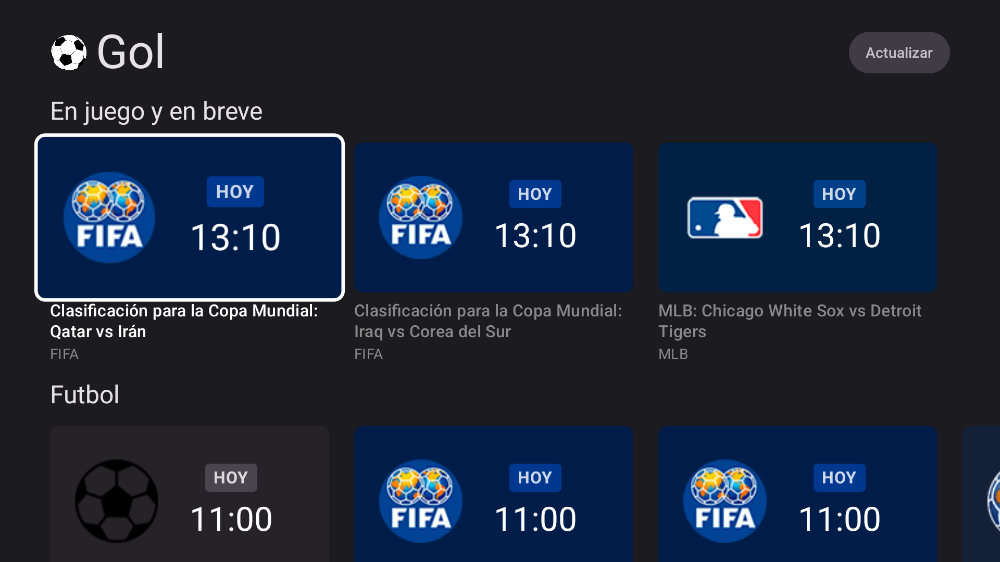
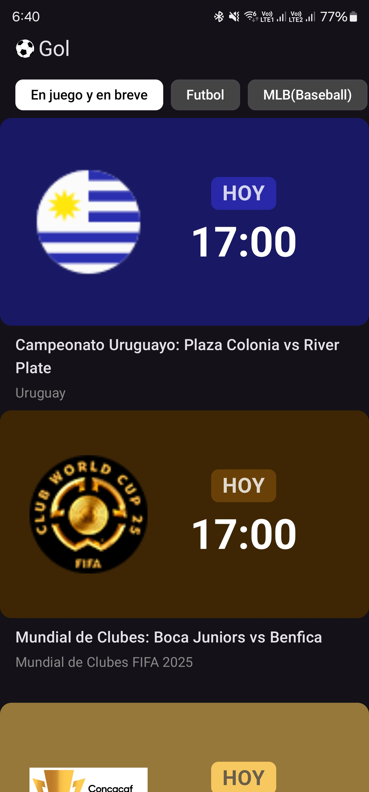

# Gol


> 🇪🇸 ¿Prefieres leer esto en español? [Ver README en español](README.es.md)

**Gol** is a Kotlin + Jetpack Compose app for Android TV and mobile that helps you watch sports events with times adjusted to **your local local timezone**. It's your personalized guide for upcoming sports, tailored to your screen and time.

## 🖼️ Screenshots

### Android TV



### Mobile

<p align="center">

</p>

## 🧩 Features

* 📺 Native support for **Android TV** and **mobile (Android 9+)**
* 🌍 **Multi-language support** (English, Spanish, Portuguese, French, German, Italian) — *New/Experimental*
* ⏰ Event times auto-adjusted to your timezone
* 🏅 Focus on **sports events** across multiple categories
* ✨ Modern UI with **Jetpack Compose**
* 🖼️ Picture-in-Picture (PiP) mode — tested on **Android 12+**, expected to work on Android 9–11

## 📦 Download

Download the APK file and install it on your Android device or Android TV.

[Download Gol.apk](../../releases/latest/download/Gol.apk)

## 🏗️ Build Instructions

Make sure you have the latest **Android Studio** and **Kotlin** installed.

### Requirements

* Android Studio Giraffe or newer
* Kotlin 2.1.21
* Android SDK 35 (minSdk 28)

### Clone & Build

```bash
git clone https://github.com/angeldevtech/Gol.git
cd gol
```

Open in Android Studio and click **Run**.

## 📄 License

This project is licensed under the [MIT License](LICENSE).

## ⚠️ Disclaimer

This is a **hobby project** and is **not affiliated with any sports broadcaster or content provider**. All content is fetched from a public API.

- **Purpose**: Gol is a client that can fetch API endpoints and display the content in a player. This application is designed for educational use only.  
- **Content Policy**: Gol does not maintain, or host any streaming service or copyrighted content.
